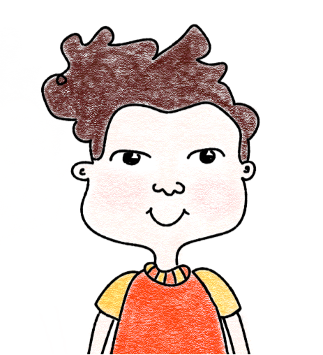

#  Hangman

# Information:

This project aims to recreate the classical Hangman game with Rust Programming Language and GTK.

# Dependencies:

libgtk-3-dev, rustup, cargo, meson.

# How to run?

After the successful installation of dependencies, clone the project repository. In the repository folder, build the project with "cargo build" command. And then, run .sh file in target folder. Or just simply run the "cargo run" command in the terminal.

# Platform:

GNU/Linux

# Screenshots:

Special thanks to Zofia Maj for her great drawings!
